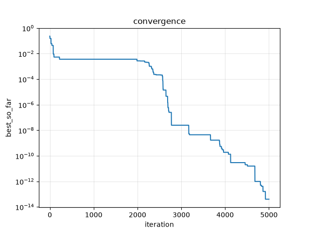
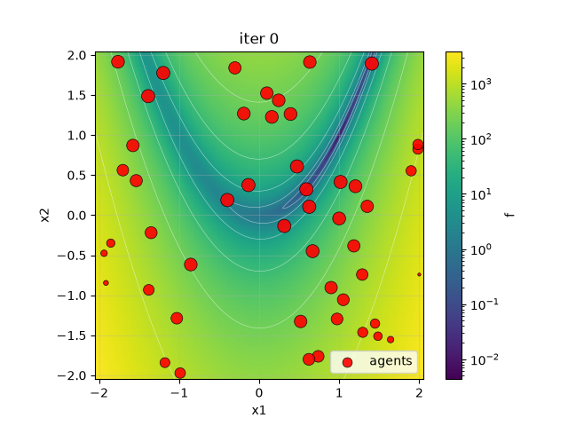
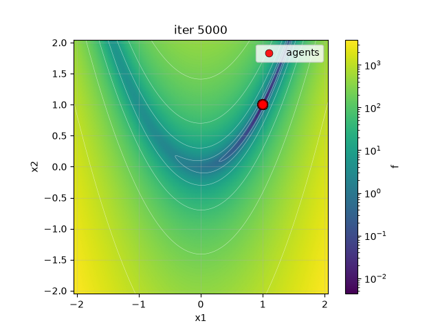
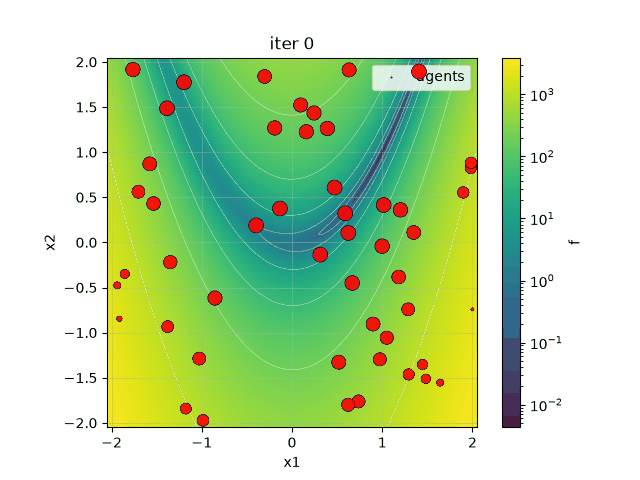

# Gravitational Search Algorithm

C++20 implementation of the Gravitational Search Algorithm (GSA, Rashedi et al.).

2D Rosenbrock demo (50 agents, 5000 iters, `seed = 42` → `best_val ≈ 1.6e-15`;
see [Visualize a run](#visualize-a-run)):



| First snapshot (iter 0) | Last snapshot (iter 5000) |
|---|---|
|  |  |



## Build

Requires [CMake](https://cmake.org) (3.20+) and [Conan 2](https://conan.io).
The `conan-release` preset (generated by Conan per machine) builds a Release
configuration in `build/Release` with `-O3 -DNDEBUG`.

### Dependencies

Conan 2 manages all external dependencies (both header-only):
- `nlohmann_json/3.11.2` — JSON configuration support
- `xoshiro-cpp/1.1` — Xoshiro256++ PRNG

No vendored dependencies; everything comes from Conan Center.

### Prerequisites (once per machine)

1. **Install Conan**: `pip install conan` (or `pipx install conan`)
2. **A C++20 compiler toolchain**:
   - Windows: [MSYS2](https://www.msys2.org/) UCRT64 → `pacman -S mingw-w64-ucrt-x86_64-{gcc,make}`, then add `C:\msys64\ucrt64\bin` to `PATH`
   - Linux: `sudo apt install build-essential` (or distro equivalent)
   - macOS: `xcode-select --install`

### Configure + Build (per platform)

```bash
# Pick the profile matching your OS (from profiles/):
#   Windows: -pr:h=profiles/windows-msys2-gcc  (also pass as -pr:b)
#   Linux:   -pr:h=profiles/linux-gcc          (also pass as -pr:b)
#   macOS:   -pr:h=profiles/macos-clang        (also pass as -pr:b)

# 1. Fetch dependencies (Windows example shown)
conan install . --build=missing -pr:h=profiles/windows-msys2-gcc -pr:b=profiles/windows-msys2-gcc

# 2. Configure with the Conan toolchain
cmake --preset conan-release

# 3. Build
cmake --build --preset conan-release
```

This generates build files under `build/Release` with the Conan toolchain
(provides `nlohmann_json` and `xoshiro-cpp` targets). The `conan-release`
preset name is stable across platforms even though its generator is not:
Conan picks MinGW Makefiles on Windows and the native generator elsewhere.

> Both dependencies are header-only, so no binaries are ever built or
> downloaded — profile compiler-version mismatches are harmless.

### Build

```bash
cmake --build --preset conan-release
```

Produces:
- `build/Release/demo.exe` — 4-example API demo (prints `best_val` + position)
- `build/Release/main.exe` — Rosenbrock demo with JSON config hot-reload (`r` to reload)
- `build/Release/tests/gsa_test.exe` — GSA invariants + determinism test harness

### Run

```bash
./build/Release/demo.exe          # 4-example API demo
./build/Release/main.exe          # JSON config hot-reload demo
./build/Release/tests/gsa_test.exe  # Full test suite (8 tests)
```

`main.exe` reads `config.json` (created on first run if missing) and waits for
input: press **`r`** to reload the file and re-run with a fresh instance — no
recompile needed; press **`q`** to quit. It prints both the raw file and the
effective settings in use (omitted fields fall back to defaults).

### Quick Syntax Check (warning-free sources)

```bash
cmake --build --preset conan-release --target check-gsa
```

### Naming Lint (Google-casing, see `.clang-tidy`)

```bash
cmake --build --preset conan-release --target check-naming
```

### Test (GSA Invariants + Determinism)

```bash
ctest --preset conan-release
```

Runs 10 CTest tests: `gsa_history`, `gsa_stats`, `gsa_determinism`, `gsa_modes`, `gsa_thread_safety`, `gsa_median`, `gsa_convergence`, `gsa_validation`, `gsa_json_io_config`, `gsa_json_io_bounds`. See `tests/` for sources. Run the binary directly to see per-test output, or pass a single test name to run only that one:

```bash
./build/Release/tests/gsa_test.exe
./build/Release/tests/gsa_test.exe determinism
```

---

### Alternative: `default` Preset (Ninja, No Conan)

If you already have `nlohmann_json` and `xoshiro-cpp` installed system-wide:

```bash
cmake --preset default
cmake --build --preset default
ctest --preset default
```

This uses a Ninja Release build in `build/` without the Conan toolchain. You must ensure both dependencies are findable via `find_package`.

### Manual Build (No CMake)

The library is header-only. Compile directly with g++ (O3, C++20):

```bash
# Using conan-installed dependencies (get include paths from conan output or compile_commands.json)
g++.exe -O3 -std=c++20 \
    -Isrc \
    -I<path_to_nlohmann_json_include> \
    -I<path_to_xoshiro_cpp_include> \
    examples/demo.cpp -o demo.exe
```

After running `conan install`, the include paths are available in `build/Release/generators/conan_toolchain.cmake` or `build/Release/compile_commands.json`.

## Usage

Header-only library in `src/gsa/gsa.hpp` (`src/gsa/stats.hpp` for fitness statistics). Primary entry point: `GravitationalSearchAlgorithm`, templated on the objective callable (any invocable of `std::span<const double>` returning `double`; deduced via CTAD).

### Basic Example: Scalar Bounds

```cpp
#include "gsa/gsa.hpp"

double sphere(std::span<const double> x) {
    double s = 0.0; for (double v : x) s += v*v; return s;
}

gsa::GravitationalSearchAlgorithm gsa(3, -5.0, 5.0, sphere);
auto best = gsa.Optimize();
std::cout << "best value: " << best.best_val << "\n";
```

### Per-Dimension Bounds and Custom Config

```cpp
gsa::GravitationalSearchAlgorithm gsa2(
    {-10.0, 0.0, -1.0},
    {10.0, 50.0, 1.0},
    sphere,
    {.n_agents = 50, .max_iter = 1000, .g0 = 10.0, .alpha = 10.0, .minimize = true}
);
auto best2 = gsa2.Optimize();
```

### Lambda Objective

```cpp
gsa::GravitationalSearchAlgorithm gsa3(2, -65.53, 65.53,
    [](std::span<const double> x){ return std::sin(x[0]) + std::cos(x[1]); },
    {.n_agents = 40, .max_iter = 500}
);
auto res3 = gsa3.Optimize();
```

### Accessing Results

```cpp
gsa::GsaResult res = gsa.Optimize();
std::vector<double> position = res.best_pos;           // best point found
std::vector<gsa::GsaIterationInfo> history = res.history;  // per-iteration stats
double last_mean = res.history.back().mean_fitness;   // mean fitness, last iter
```

Each `gsa::GsaIterationInfo` records: `best_so_far`, `best_iter`, `worst_iter`, `mean_fitness`, `median_fitness`, `stddev_fitness`.

Set `cfg.snapshot_count = N` to also capture all agent positions, masses
and fitnesses at `N` evenly spaced iterations (always including iter 0
and `max_iter`; `0` = off, `1` = final only, max `max_iter + 1`).
Captures land in `res.snapshot_iters` plus flat `res.snapshot_positions`
(snap → agent → dim), `res.snapshot_masses` and `res.snapshot_fitnesses`
(snap → agent).

### Visualize a run

1. Set `"snapshot_count"` in `config.json` (e.g. `10`) and run `main` —
   every run exports to `exports/run_<yyyymmdd_hhmmss>/` (`history.csv`,
   `snapshots.csv`, plus the effective `config.json`). Both CSVs have
   header rows: `history.csv` holds
   `best_so_far,best_iter,worst_iter,mean_fitness,median_fitness,stddev_fitness`;
   `snapshots.csv` holds `iter,agent,mass,fitness,x1..xD`.
2. From the repo root with `.venv` active, one command plots everything:

```bash
.venv/Scripts/python scripts/plot_gsa.py exports/run_20260203_120000
```

| Output (next to the CSVs) | Content |
|---|---|
| `convergence.png` | log-scale `best_so_far` vs iteration |
| `contour_first/last.png` | agents (dot size ∝ per-frame mass) on heatmap contours, first/last snapshot |
| `anim.gif` | every snapshot animated (5 fps) |

Bounds and dims come from the run's own `config.json` — no retyping.
Contour backgrounds assume 2D and mirror the default Rosenbrock objective;
if you edit `objective.hpp`, update the EDIT block (`objective_2d` +
`LEVELS`) at the top of `scripts/plot_gsa.py`. Scatter, convergence and
animation are purely data-driven and work for any objective.

### Example: 2D Rosenbrock run

Config: 2D, bounds ±2.048, 50 agents, 5000 iters, `g0 = alpha = 10`,
`seed = 42`, `snapshot_count = 10` → `best_val ≈ 1.6e-15` (global
minimum at (1, 1)). The plots are shown at the top of this file
(sources in `docs/images/`, regenerable via `scripts/plot_gsa.py`).

### JSON Configuration

Parse JSON yourself, then load from the object:

```cpp
#include "gsa/gsa.hpp"
#include "gsa/json_io.hpp"
#include <nlohmann/json.hpp>

nlohmann::json j = nlohmann::json::parse(std::ifstream("config.json"));
gsa::GsaConfig cfg = gsa::LoadConfigFromJson(j);
gsa::GravitationalSearchAlgorithm gsa(3, -5.0, 5.0, sphere, cfg);
auto best = gsa.Optimize();
```

Example `config.json`:
```json
{
  "dimensions": 10,
  "lower": -2.048,
  "upper": 2.048,
  "n_agents": 40,
  "max_iter": 500,
  "g0": 10.0,
  "alpha": 20.0,
  "minimize": true,
  "seed": 12345,
  "snapshot_count": 0
}
```

`"lower"`/`"upper"` may also be per-dimension arrays (lengths must equal
`"dimensions"`, or define it when omitted):

```json
{
  "lower": [-10.0, 0.0, -1.0],
  "upper": [10.0, 50.0, 1.0]
}
```

Mixing forms (scalar on one side, array on the other) is accepted by the JSON
loader when `"dimensions"` is given. Direct C++ constructors do not mix: both
bounds must be scalars or both vectors (`std::vector<double>(n, v)` fills one).

Load bounds alongside the algorithm config:

```cpp
nlohmann::json j;
std::ifstream("config.json") >> j;
gsa::GsaConfig cfg{gsa::LoadConfigFromJson(j)};
gsa::Bounds b{gsa::LoadBoundsFromJson(j)};
gsa::GravitationalSearchAlgorithm gsa(b.dimensions, b.lower, b.upper, sphere, cfg);
```

Or from a JSON string:

```cpp
#include "gsa/json_io.hpp"

const char* json = R"({
    "n_agents": 40,
    "max_iter": 500,
    "g0": 10.0,
    "alpha": 20.0
})";

gsa::GsaConfig cfg = gsa::LoadConfigFromString(json);
gsa::GravitationalSearchAlgorithm gsa(3, -5.0, 5.0, sphere, cfg);
```

### Changing Config Between Runs

The instance is immutable; to change configuration, assign a new instance
(all members are value types, so this is cheap and memory-safe):

```cpp
gsa::GravitationalSearchAlgorithm gsa(3, -5.0, 5.0, sphere);
auto res1 = gsa.Optimize();  // default config

// New config for the second run
gsa = gsa::GravitationalSearchAlgorithm(
    3, -5.0, 5.0, sphere,
    {.n_agents = 20, .g0 = 5.0, .alpha = 5.0});
auto res2 = gsa.Optimize();
```

Each `Optimize()` call is an independent run: positions are re-randomized and
velocities/accelerations reset at the start.

### Configuration Tuning

- `n_agents` (size_t): number of agents/particles. Default: `40`.
- `max_iter` (size_t): number of iterations. Default: `500`.
- `g0` (double): initial gravitational constant. Default: `100.0`.
- `alpha` (double): decay rate for `G(t) = g0 * exp(-alpha * t)`. Default: `20`.
- `minimize` (bool): `true` to minimize, `false` to maximize. Default: `true`.
- `seed` (uint64_t): RNG seed for reproducible runs; `0` uses `std::random_device`. Default: `0`.

**Tip:** `g0` is scale-dependent — tune it to your bounds. If the solver stalls early (all agents collapse onto the initial best), forces are too strong: try *decreasing* `g0` or *increasing* `alpha`. If it barely moves, forces are too weak: *increase* `g0` or *decrease* `alpha`. For a `[-5, 5]` domain `g0 = 10.0` converges cleanly, while the default `g0 = 100.0` overshoots and stalls.

## Tests

`tests/` holds a self-contained framework (`test_framework.hpp` registers named tests; `test_common.hpp` shares objectives/invariant helpers). Individual tests in `tests/tasks/`, one `*.cpp` per test, registered as separate CTest entries:

- `test_history.cpp` — history size `== max_iter + 1`, monotonic `best_so_far`, mean/median within `[best_iter, worst_iter]`, finite non-negative `stddev` (both modes).
- `test_stats.cpp` — history stats finite and in-range across objectives.
- `test_determinism.cpp` — same-seed bit-identical results on sphere/rosenbrock/Shekel.
- `test_modes.cpp` — `minimize` true/false and odd agent count (median).
- `test_thread_safety.cpp` — 8 concurrent `Optimize()` calls on one instance are bit-identical.
- `test_median.cpp` — direct unit test of `ComputeFitnessStats`: exact median `(n-1)/2` for even/odd populations in both modes, plus scrambled even array.
- `test_convergence.cpp` — fixed-seed sphere run converges (`best_val < 0.01`; uses `g0 = 10.0`).
- `test_validation.cpp` — constructor rejects empty/mismatched bounds, zero agents, zero iterations, `lower > upper`, `snapshot_count > max_iter + 1` with `std::invalid_argument`.
- `test_snapshots.cpp` — snapshot iters exact (`{0,100,…,500}` for count 6), flat size `== snaps·agents·dims`, same-seed identical, CSV line counts + `best_so_far` round-trip.

Build manually with:

```bash
g++.exe -O3 -std=c++20 -Isrc \
    -I<path_to_nlohmann_json_include> \
    -I<path_to_xoshiro_cpp_include> \
    tests/test_main.cpp tests/tasks/test_history.cpp \
    tests/tasks/test_stats.cpp tests/tasks/test_determinism.cpp \
    tests/tasks/test_modes.cpp tests/tasks/test_thread_safety.cpp \
    tests/tasks/test_median.cpp tests/tasks/test_convergence.cpp \
    tests/tasks/test_validation.cpp tests/tasks/test_snapshots.cpp -o gsa_test.exe
```

Run (or use `ctest --preset conan-release`):

```bash
./gsa_test.exe
./gsa_test.exe determinism
```
